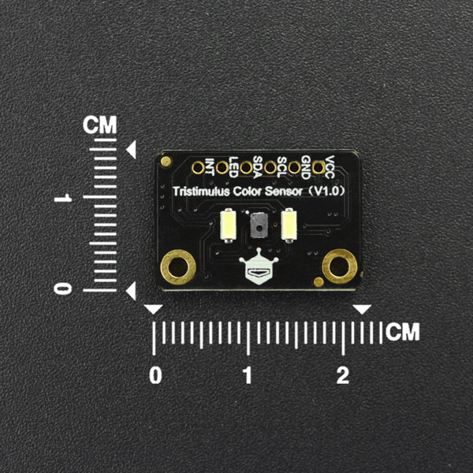

# DFRobot_TCS3430
- [English Version](./README.md)

TCS3430具有先进的数字环境光感测（ALS）和CIE 1931三刺激色彩感测（XYZ），CIE1931 XYZ三刺激模型是根据人眼中三种视锥细胞设立的XYZ标准，CIE1931 XYZ色彩空间包含普通视力的人可以看到的所有色彩感觉。TCS3430的光谱响应几乎和人眼一致，可以实现高精度的照度和色温测量，因此可以实现所测即所见。



## 产品链接(https://www.dfrobot.com.cn/goods-3083.html)

    SKU：DFR0464

## 目录

* [概述](#概述)
* [库安装](#库安装)
* [方法](#方法)
* [兼容性](#兼容性y)
* [历史](#历史)
* [创作者](#创作者)

## 概述

X/Y/Z刺激光和红外数据的检测

## 库安装

使用此库前，请首先下载库文件，将其粘贴到\Arduino\libraries目录中，然后打开examples文件夹并在该文件夹中运行演示。

## 方法

```C++
 /**
   * @brief  Initialization function
   * @return Whether the device is on or not. return true succeed ;return false failed.
   */
  bool begin();

  /**
   * @brief  Config the wait timer 
   * @param  mode  true : enable ; false : disenable
   */
  void setWaitTimer(bool mode = true);

  /**
   * @brief  Set the function of wait long time
   * @param  mode  true : enable ; false : disenable
   */
  void setWaitLong(bool mode = true);

  /**
   * @brief  Set the internal integration time of the  four-channel ADCs
   * @param  aTIme  integration time
   */
  void setIntegrationTime(uint8_t aTime);

  /**
   * @brief  set wait time 
   * @param  wTime  wait time 
   */
  void setWaitTime(uint8_t wTime);

  /**
   * @brief  Set the ALS gain 
   * @param  aGain  the value of gain
   */
  void setALSGain(uint8_t aGain);

  /**
   * @brief  Set ALS interrupt Persistence
   * @param  apers :ALS Interrupt Persistence
   */
  void setInterruptPersistence(uint8_t apers);

  /**
   * @brief  get device status
   * @return  status
   */
  uint8_t getDeviceStatus();
  
  /**
   * @brief  get channel 0 value
   * @return  the z data
   */
  uint16_t getZData();

  /**
   * @brief  get channel 1 value
   * @return  the y data
   */
  uint16_t getYData();

  /**
   * @brief  get channel 2 value
   * @return  the IR1 data 
   */
  uint16_t getIR1Data();
  
  /**
   * @brief  get channel 3 value
   * @return  the x data
   */
  uint16_t getXData();
  
  /**
   * @brief  get channel 3 value
   * @return  the IR2 data
   */
  uint16_t getIR2Data();
  /**
   * @brief  Set the ALS High gain 
   * @param  mode  true : enable ; false : disenable
   */
  void setHighGAIN(bool mode);

  /**
   * @brief  If this bit is set, all flag bits in the STATUS register will be reset whenever the STATUS register is read over I2C.
   * @param  mode  true : enable ; false : disenable
   */
  void setIntReadClear(bool mode = true);

  /**
   * @brief  Config the function of 'sleep after interruption'
   * @param  mode  true : enable ; false : disenable
   */
  void setSleepAfterInterrupt(bool mode = true);

  /**
   * @brief  set az mode
   * @param  mode  :0,Always start at zero when searching the best offset value
                   :1,Always start at the previous (offset_c) with the auto-zero mechanism
   */
  void setAutoZeroMode(uint8_t mode);
  
  /**
   * @brief  set az nth iteration type(Run autozero automatically every nth ALS iteration)
   * @param  value :0,never
                   :7,only at first ALS cycle
                   :n, every nth time
   */
  void setAutoZeroNTHIteration(uint8_t value);

  /**
   * @brief  Config the ALS saturation interruption
   * @param  mode  true : enable ; false : disenable
   */
  void setALSSaturationInterrupt(bool mode = true);

  /**
   * @brief  Config the ALS interruption
   * @param  mode  true : enable ; false : disenable
   */
  void setALSInterrupt(bool mode = true);

  /**
   * @brief  Set the channel 0 interrupt threshold
   * @param  thresholdL :the low 16 bit values
   * @param  thresholdH :the high 16 bit values
   */
  void setCH0IntThreshold(uint16_t thresholdL,uint16_t thresholdH);
```

## 兼容性

| 主板          | 通过 | 未通过 | 未测试 | 备注 |
| ------------- | :--: | :----: | :----: | ---- |
| Arduino uno   |  √   |        |        |      |
| Mega2560      |  √   |        |        |      |
| Leonardo      |  √   |        |        |      |
| ESP32         |  √   |        |        |      |
| micro:bit     |  √   |        |        |      |
| FireBeetle M0 |  √   |        |        |      |


## 历史

- 日期 2023-2-24
- 版本 V1.0.0


## 创作者

Written by yangfeng(feng.yang@dfrobot.com), 2021. (Welcome to our [website](https://www.dfrobot.com/))

